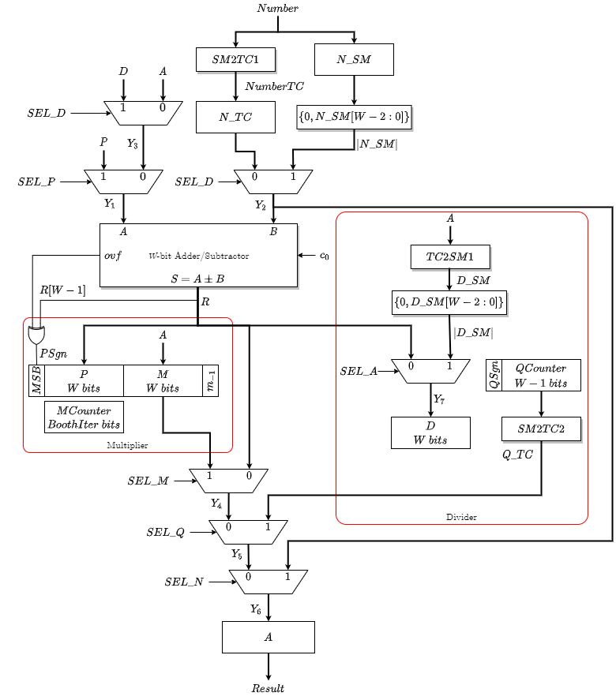

# Sequential Arithmetic Four-Function Calculator

This repo implements a Sequential Four Function Calculator (Add, Sub, Multiply, Divde) that efficiently utilizes FSM, Ripple Carry Adder, Booth Multiplier Algorithm, Quotient Divider
for its arithmetic logic. 

- "FourFuncCalc.sv" - the main design of the calculator datapath
- "top.sv" - the top-level module for physical testing on Altera's FPGA
- "ClockDiv.sv" - clock divider module for clock calibration
- "Binary_to_7SEG.sv" - LUT module for binary to 7SEG display 
- "AddSub.sv" - a parameterized ripple add/subtract module
- "FullAdder.sv" - full adder 1-bit
- "SM2TC.sv" - signed magnitude encoding conversion to two's complement encoding
- "TC2SM.sv" - two's complement encoding to signed magnitude encoding

This calculator follows the data path below:

## Testing
Fully tested.
- "FourFuncCalc_tb.sv" - testing framework for the full functionality of the calculator
- "Binart_to_7SEG_tb.sv" - testbench for Binary_to_7SEG.sv